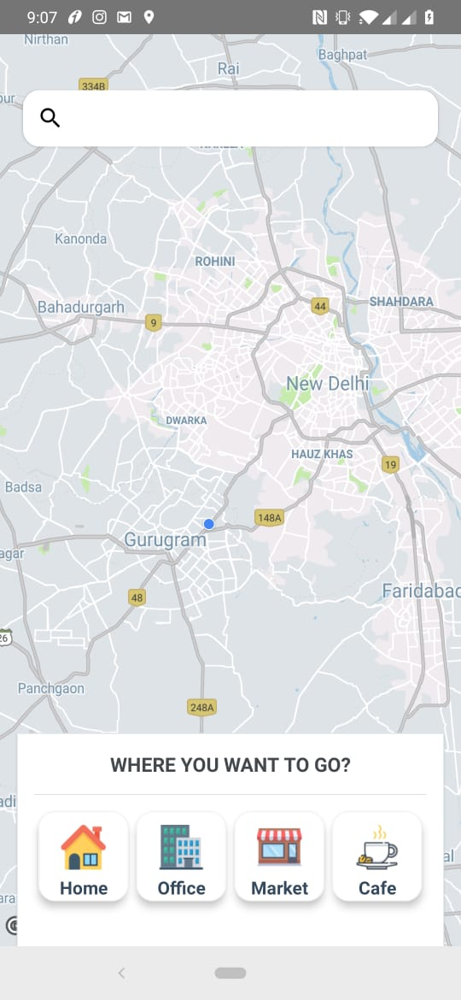
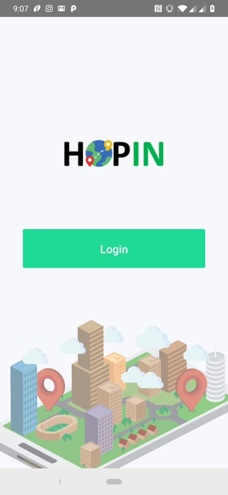
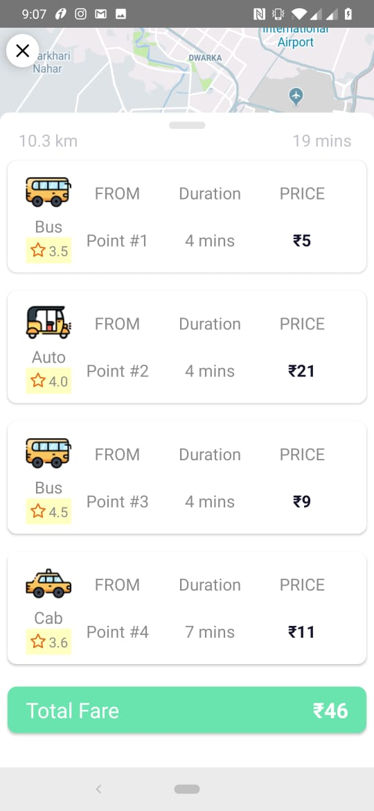
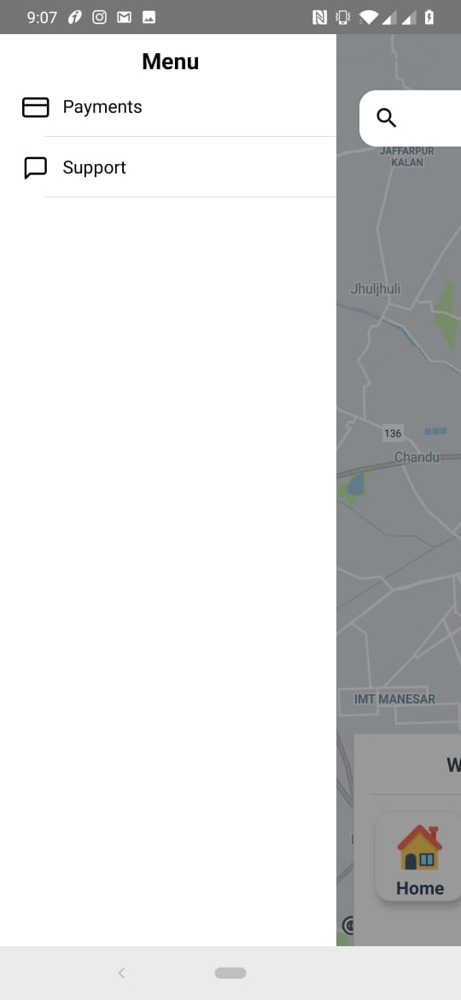
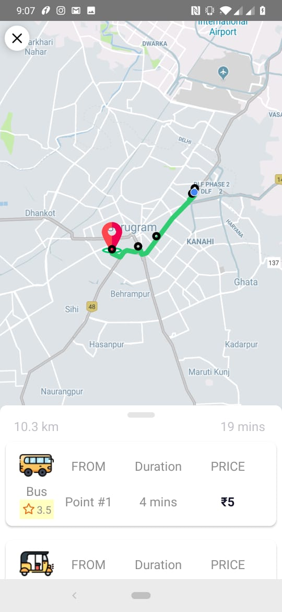
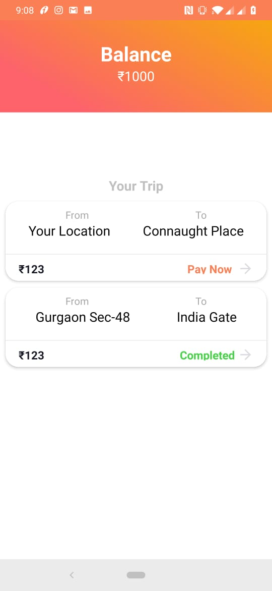
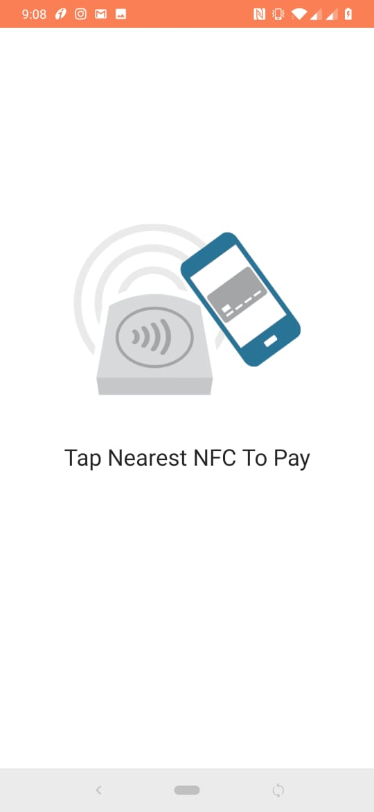

# HopIn
A end to end travel solution

Our Idea is generalized, targeting the public for a smarter way of travel, less constrained on both time and a smarter way to travel from public transport. The solution will encourage the audience to use public transport more conveniently and easily.

Today's Problem For a comfortable journey requires pre-booking. A traveler must visit multiple places or websites to book for airplane, train, bus, and taxi separately. Getting a good travel experience requires a convenient fee which charges a lot and includes middle man charges. No such reliable public transport booking app or website is there to trace and book your journey easily.

Abstract of Idea The idea is based upon the need of the public to get best travel experience with less hassle, convenient and best-priced fares. With the ability to live to track of the public vehicle before the journey begins. A smarter payment solution which can automatically make total journey fare based on government norms. It’s for general public to book a journey through a bus, cab, auto, train or any other public transport at one go. The booking is very similar to today's booking app like Ola and Uber. The solution will provide live tracking of the public transport, will provide better tracking and finding the transport before the journey begins. The solution will (a) eliminate the middle men (b) provide a fast and reliable solution to book any kind of the public transport (c) provide a live tracking to the user. (d) provide a better and easy payment solution between the transport provider and user.

The user just enters the pickup and drop locations, algorithm sorts out the best possible route and the trip depending on multiple factors (minimum wait time, live traffic tracking, crowd presence, etc.). The second step is where we foray the abstraction, of the ideal principles of the firm. User just HopsIn (yes, that's a verb now) reaches the location and gets off. Evidently, the input from the user is minimum albeit the back-end algorithm works at full throttle. Ultimately, the payment aspect of things is done seamlessly contact lessly.
Implementation looks into payment facet thorugh wireless methods (NFC, WI-Fi or be it Bluetooth). Financial web clients could be assigned for the payments 

# Presentation 
Pitch Presentation:
https://drive.google.com/file/d/1tqoeE3QTXhjBVPuR3P8LWZZW_4iO2zQE/view?usp=sharing

Final Presentation:
https://drive.google.com/file/d/12k64aoqnZOgOJnEZ0Dhq0MjElWzJ0CFI/view?usp=sharing

# Images: 
      

